# Sequence Diagram chi tiết cho Nhắn tin và Thông báo

Ngày lập: 27/05/2026

Tài liệu này mô tả luồng hiện tại của chức năng nhắn tin và thông báo theo code trong dự án.

## Thành phần chính

| Nhóm | Thành phần | Vai trò |
| --- | --- | --- |
| Frontend | `MessagesView.tsx` | Màn hình danh sách hội thoại, khung chat, gửi text/file, đánh dấu đã đọc |
| Frontend | `useConversations.ts` | Gọi API hội thoại, lắng nghe socket chat |
| Frontend | `NotificationsView.tsx` | Hiển thị thông báo, mở bài viết/profile khi bấm thông báo |
| Frontend | `useNotifications.ts` | Gọi API thông báo, lắng nghe `notification:new` |
| Frontend | `socketService.ts` | Khởi tạo Socket.IO client singleton |
| Backend | `conversationRoutes.ts` | Route REST cho hội thoại và tin nhắn |
| Backend | `conversationController.ts` | Xử lý CRUD tin nhắn/hội thoại, upload file, read receipt |
| Backend | `chatHandlers.ts` | Xử lý socket typing, join room, mark read |
| Backend | `notificationController.ts` | Tạo, lấy, đọc, xóa thông báo |
| Backend | `reactionController.ts` | Tạo thông báo khi like bài viết |
| Backend | `commentController.ts` | Tạo thông báo khi comment bài viết |
| Backend | `followController.ts` | Tạo thông báo khi follow/follow request |
| Backend | MongoDB | Lưu `Conversation`, `Message`, `Notification`, `Post`, `Follow`, `Reaction` |
| Backend | MinIO | Lưu ảnh/file đính kèm trong tin nhắn |

## 1. Khởi tạo Socket.IO sau khi đăng nhập

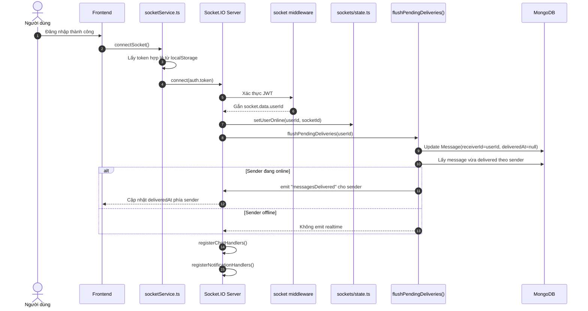

Ghi chú:

- Socket client là singleton, không tự connect khi tạo instance.
- Token được gửi qua `socket.handshake.auth.token`.
- Khi user online lại, backend đánh dấu các tin nhắn chưa delivered thành delivered.

## 2. Tải danh sách hội thoại

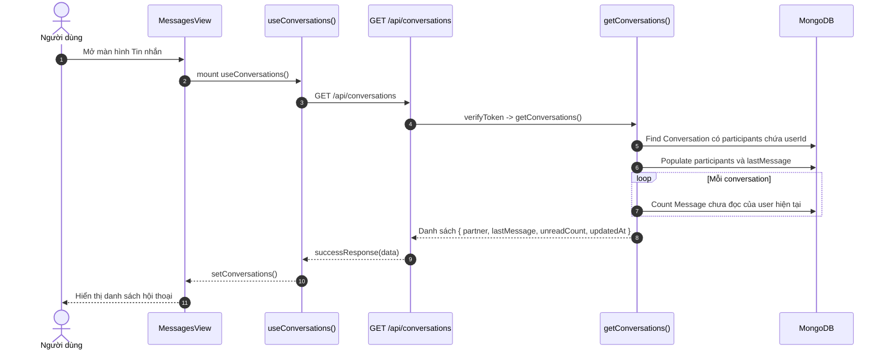

Điểm quan trọng:

- Backend chỉ trả `partner` là người còn lại trong hội thoại để frontend dùng trực tiếp.
- `unreadCount` được tính bằng các tin có `receiverId = userId` và `readAt = null`.
- Tin bị xóa phía user hiện tại được lọc bằng `deletedBy != userId`.

## 3. Tạo hoặc mở hội thoại với một người dùng

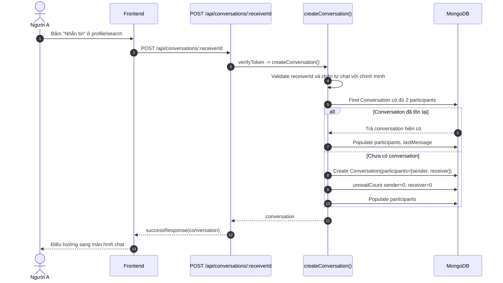

## 4. Chọn hội thoại và tải tin nhắn

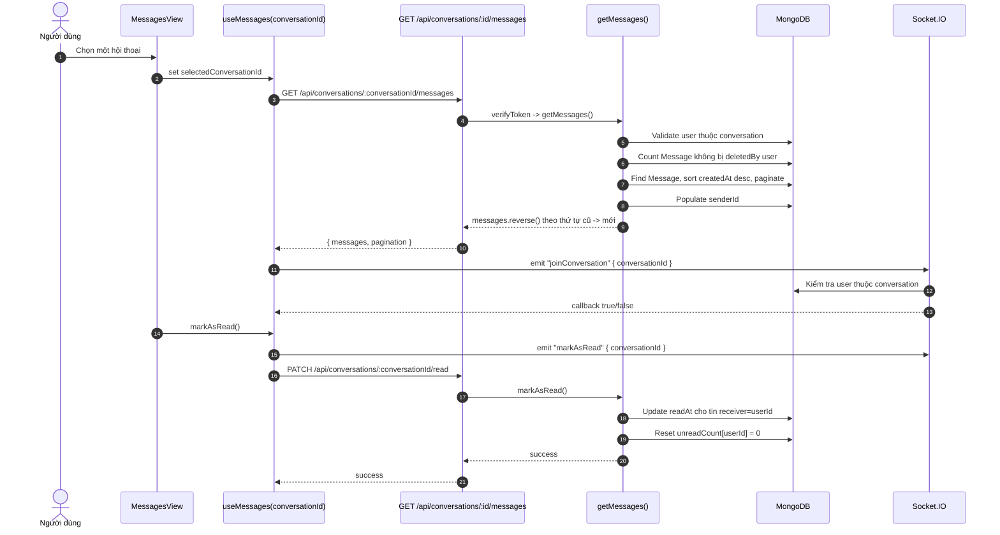

Lưu ý:

- Frontend hiện đánh dấu đã đọc bằng cả socket `markAsRead` và REST `PATCH /read`.
- Hai thao tác này idempotent: chạy lại không làm sai dữ liệu vì chỉ set `readAt` và reset unread về `0`.

## 5. Gửi tin nhắn text realtime

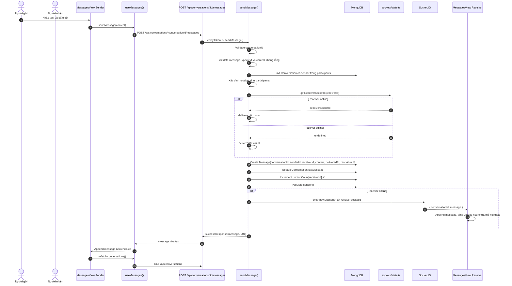

Kết quả:

- Người gửi thấy tin nhắn ngay sau response REST.
- Người nhận online nhận realtime qua `newMessage`.
- Người nhận offline sẽ thấy tin khi mở lại hội thoại; `deliveredAt` được flush khi họ reconnect socket.

## 6. Gửi ảnh hoặc file đính kèm

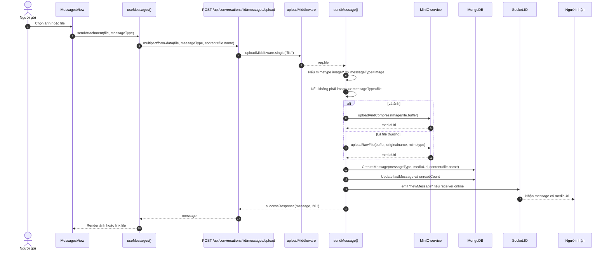

Điểm validate:

- Tin `text` bắt buộc có `content`.
- Tin `image` hoặc `file` bắt buộc có `mediaUrl`.
- Nếu upload file không có caption, backend dùng `originalname` làm `content`.

## 7. Typing indicator

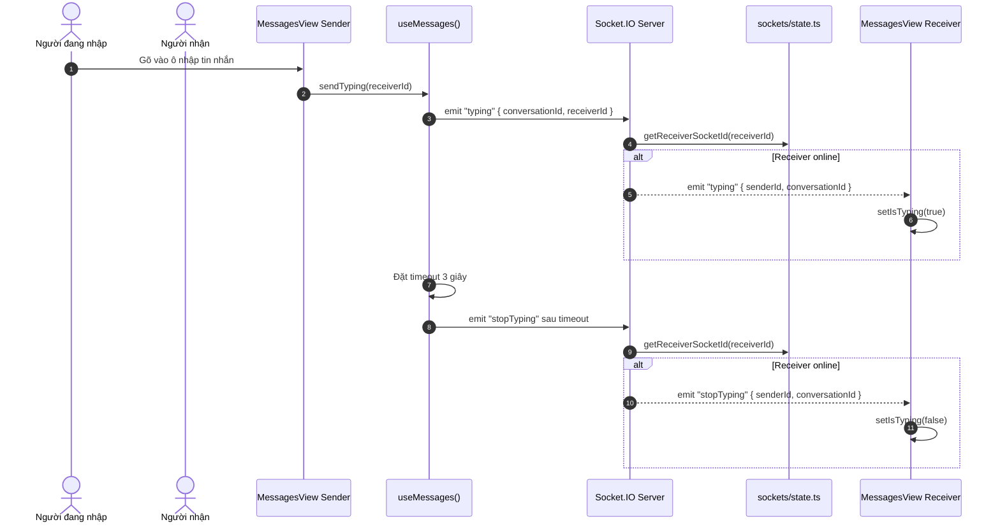

## 8. Read receipt và unread count

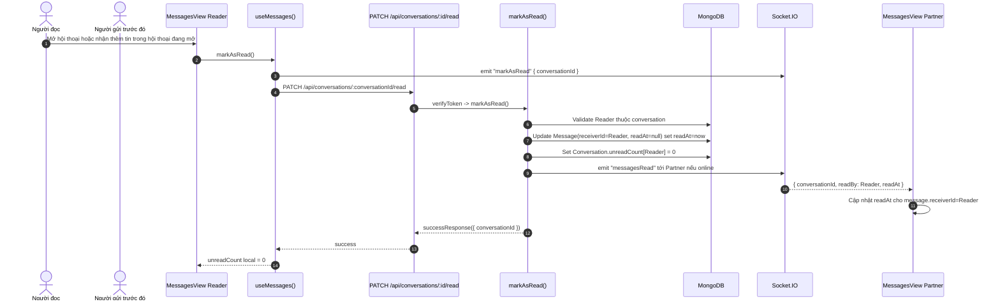

## 9. Xóa tin nhắn phía mình

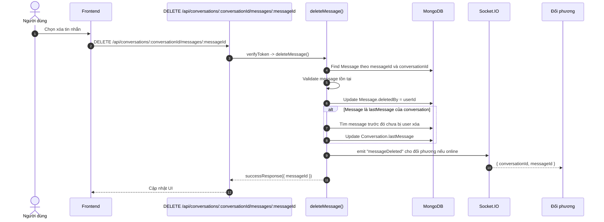

Lưu ý: theo controller hiện tại, xóa tin nhắn là xóa phía người dùng thông qua `deletedBy`.

## 10. Tải danh sách thông báo

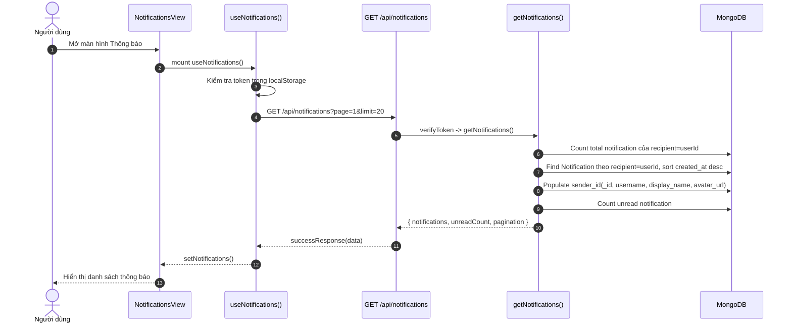

## 11. Tạo thông báo realtime khi Like bài viết

```mermaid
sequenceDiagram
    autonumber
    actor Actor as Người like bài
    actor Owner as Người đăng bài
    participant FE as Frontend Actor
    participant API as POST /api/post/:postId/react
    participant ReactCtrl as reactToPost()
    participant DB as MongoDB
    participant NotiCtrl as createNotification()
    participant State as sockets/state.ts
    participant IO as Socket.IO
    participant OwnerUI as useNotifications Owner

    Actor->>FE: Bấm Like bài viết
    FE->>API: POST /api/post/:postId/react
    API->>ReactCtrl: verifyToken -> reactToPost()
    ReactCtrl->>DB: Validate postId, find Post
    ReactCtrl->>DB: Find Reaction(post_id, user_id, type=like)
    alt Đã like trước đó
        ReactCtrl->>DB: Delete Reaction
        ReactCtrl->>DB: Decrease post.stats.likes
        ReactCtrl-->>API: { likes, is_liked:false }
    else Chưa like
        ReactCtrl->>DB: Create Reaction
        ReactCtrl->>DB: Increase post.stats.likes
        alt Actor không phải chủ bài viết
            ReactCtrl->>NotiCtrl: createNotification(recipient=post.author_id, sender=actor, type=like, target_id=postId)
            NotiCtrl->>DB: Create Notification
            NotiCtrl->>DB: Populate sender_id
            NotiCtrl->>State: getReceiverSocketId(ownerId)
            alt Owner online
                NotiCtrl->>IO: emit "notification:new" tới owner
                IO-->>OwnerUI: prepend notification vào state
            else Owner offline
                NotiCtrl-->>ReactCtrl: Chỉ lưu DB, không emit
            end
        else Actor tự like bài của mình
            ReactCtrl-->>ReactCtrl: Không tạo notification
        end
        ReactCtrl-->>API: { likes, is_liked:true }
    end
    API-->>FE: successResponse
```

Dữ liệu notification like:

| Field | Giá trị |
| --- | --- |
| `recipient_id` | ID chủ bài viết |
| `sender_id` | ID người like |
| `type` | `like` |
| `target_id` | ID bài viết |
| `message` | "đã thích bài viết của bạn" |

## 12. Tạo thông báo realtime khi Comment bài viết

```mermaid
sequenceDiagram
    autonumber
    actor Actor as Người bình luận
    actor Owner as Chủ bài viết
    participant FE as Frontend Actor
    participant API as POST /api/post/:postId/comments
    participant CommentCtrl as createComment()
    participant DB as MongoDB
    participant NotiCtrl as createNotification()
    participant IO as Socket.IO
    participant OwnerUI as useNotifications Owner

    Actor->>FE: Gửi bình luận
    FE->>API: POST /api/post/:postId/comments { content, parent_id? }
    API->>CommentCtrl: verifyToken -> createComment()
    CommentCtrl->>DB: Validate postId và content
    CommentCtrl->>DB: Find Post
    opt Là reply
        CommentCtrl->>DB: Validate parent comment cùng post
    end
    CommentCtrl->>DB: Create Comment(post_id, author_id, parent_id, content)
    CommentCtrl->>DB: Increase post.stats.comments
    opt Là reply
        CommentCtrl->>DB: Increase parent.stats.replies
    end
    CommentCtrl->>DB: Populate author_id
    alt Actor không phải chủ bài viết
        CommentCtrl->>NotiCtrl: createNotification(type=comment, target_id=postId)
        NotiCtrl->>DB: Create Notification
        NotiCtrl->>DB: Populate sender_id
        NotiCtrl->>IO: emit "notification:new" nếu Owner online
        IO-->>OwnerUI: Nhận notification realtime
    else Actor tự comment bài mình
        CommentCtrl-->>CommentCtrl: Không tạo notification
    end
    CommentCtrl-->>API: successResponse(comment, 201)
    API-->>FE: Render comment mới
```

Dữ liệu notification comment:

| Field | Giá trị |
| --- | --- |
| `recipient_id` | ID chủ bài viết |
| `sender_id` | ID người comment |
| `type` | `comment` |
| `target_id` | ID bài viết |
| `message` | "đã bình luận bài viết của bạn" |

## 13. Tạo thông báo realtime khi Follow

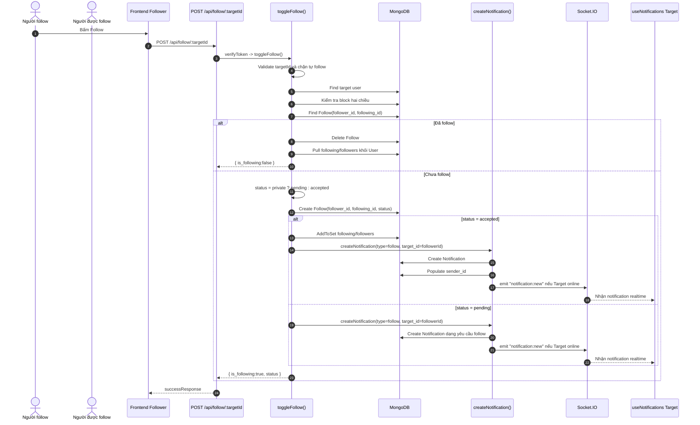

Dữ liệu notification follow:

| Field | Giá trị |
| --- | --- |
| `recipient_id` | ID người được follow |
| `sender_id` | ID người vừa follow |
| `type` | `follow` |
| `target_id` | ID người vừa follow |
| `message` | "đã theo dõi bạn" hoặc "đã gửi yêu cầu theo dõi bạn" |

## 14. Đánh dấu thông báo đã đọc

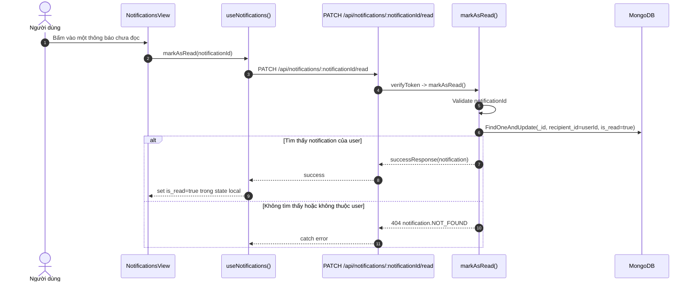

Ngoài REST, backend còn có socket event:

- `notification:read` để đánh dấu một notification đã đọc.
- `notification:readAll` để đánh dấu tất cả đã đọc.

Frontend web hiện dùng REST trong `useNotifications.ts`.

## 15. Bấm thông báo Like/Comment/Mention để mở bài viết

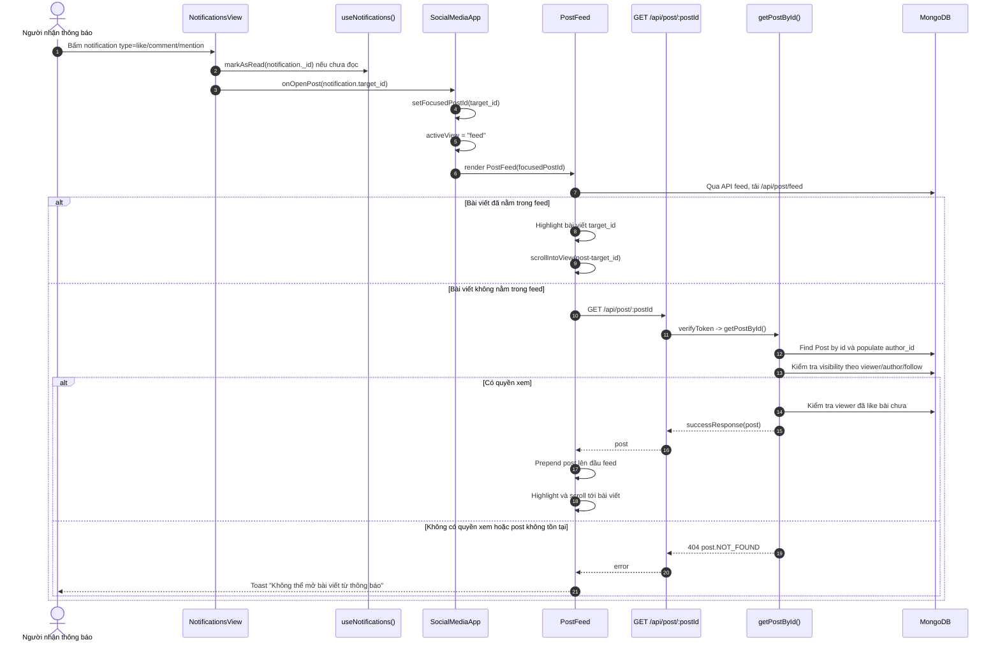

Quy tắc điều hướng:

- `like`, `comment`, `mention` dùng `target_id` làm `postId`.
- `PostFeed` sẽ tải thêm bài cụ thể nếu bài không có trong feed hiện tại.

## 16. Bấm thông báo Follow để mở trang cá nhân

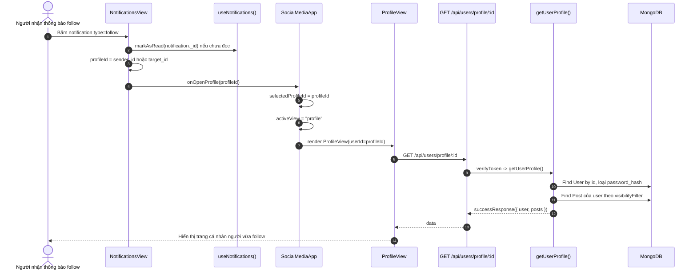

Quy tắc điều hướng:

- `sender_id` ưu tiên hơn vì đó là người tạo hành động follow.
- Nếu `sender_id` chỉ là string hoặc bị thiếu object populate, frontend fallback sang `target_id`.

## 17. Đánh dấu tất cả thông báo đã đọc

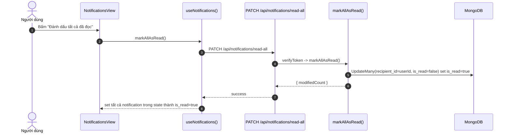

## 18. Tổng hợp event Socket.IO

| Event | Hướng | Payload chính | Mục đích |
| --- | --- | --- | --- |
| `newMessage` | Backend -> Client receiver | `{ conversationId, message }` | Đẩy tin nhắn mới realtime |
| `typing` | Client sender -> Backend -> Client receiver | `{ conversationId, receiverId }` / `{ senderId, conversationId }` | Báo người gửi đang nhập |
| `stopTyping` | Client sender -> Backend -> Client receiver | `{ conversationId, receiverId }` / `{ senderId, conversationId }` | Tắt trạng thái đang nhập |
| `joinConversation` | Client -> Backend | `{ conversationId }` | Join room sau khi mở hội thoại |
| `leaveConversation` | Client -> Backend | `{ conversationId }` | Rời room khi đổi/unmount hội thoại |
| `markAsRead` | Client -> Backend -> Client partner | `{ conversationId }` / `{ conversationId, readBy, readAt }` | Đánh dấu tin nhắn đã đọc |
| `messagesRead` | Backend -> Client partner | `{ conversationId, readBy, readAt }` | Cập nhật read receipt |
| `messagesDelivered` | Backend -> Client sender | `{ receiverId, messageIds }` | Cập nhật delivered khi receiver online lại |
| `messageDeleted` | Backend -> Client partner | `{ conversationId, messageId }` | Báo tin nhắn bị xóa |
| `notification:new` | Backend -> Client recipient | `Notification` đã populate sender | Đẩy thông báo mới realtime |
| `notification:read` | Client -> Backend | `{ notificationId }` | Đánh dấu một thông báo đã đọc qua socket |
| `notification:readAll` | Client -> Backend | callback boolean | Đánh dấu tất cả thông báo đã đọc qua socket |

## 19. Tổng hợp API REST liên quan

### Nhắn tin

| Method | Endpoint | Controller | Mục đích |
| --- | --- | --- | --- |
| `GET` | `/api/conversations` | `getConversations` | Lấy danh sách hội thoại |
| `POST` | `/api/conversations/:receiverId` | `createConversation` | Tạo hoặc lấy hội thoại 1-1 |
| `GET` | `/api/conversations/:conversationId/messages` | `getMessages` | Lấy tin nhắn trong hội thoại |
| `POST` | `/api/conversations/:conversationId/messages` | `sendMessage` | Gửi tin text |
| `POST` | `/api/conversations/:conversationId/messages/upload` | `sendMessage` | Gửi ảnh/file qua upload |
| `DELETE` | `/api/conversations/:conversationId/messages/:messageId` | `deleteMessage` | Xóa tin nhắn phía mình |
| `PATCH` | `/api/conversations/:conversationId/read` | `markAsRead` | Đánh dấu hội thoại đã đọc |

### Thông báo

| Method | Endpoint | Controller | Mục đích |
| --- | --- | --- | --- |
| `GET` | `/api/notifications` | `getNotifications` | Lấy danh sách thông báo |
| `GET` | `/api/notifications/unread-count` | `getUnreadCount` | Lấy số thông báo chưa đọc |
| `PATCH` | `/api/notifications/:notificationId/read` | `markAsRead` | Đánh dấu một thông báo đã đọc |
| `PATCH` | `/api/notifications/read-all` | `markAllAsRead` | Đánh dấu tất cả đã đọc |
| `DELETE` | `/api/notifications/:notificationId` | `deleteNotification` | Xóa một thông báo |
| `GET` | `/api/post/:postId` | `getPostById` | Mở bài viết từ notification target_id |
| `GET` | `/api/users/profile/:id` | `getUserProfile` | Mở profile từ notification follow |

## 20. Dữ liệu lõi

### Message

| Field | Ý nghĩa |
| --- | --- |
| `conversationId` | Hội thoại chứa tin nhắn |
| `senderId` | Người gửi |
| `receiverId` | Người nhận |
| `messageType` | `text`, `image`, `file` |
| `content` | Nội dung text hoặc tên file |
| `mediaUrl` | Link ảnh/file nếu có |
| `deletedBy` | User đã xóa tin phía mình |
| `deliveredAt` | Thời điểm tin được delivered tới receiver |
| `readAt` | Thời điểm receiver đọc tin |

### Conversation

| Field | Ý nghĩa |
| --- | --- |
| `participants` | Hai user trong chat 1-1 |
| `lastMessage` | Message cuối cùng để preview |
| `unreadCount` | Map số tin chưa đọc theo userId |

### Notification

| Field | Ý nghĩa |
| --- | --- |
| `recipient_id` | Người nhận thông báo |
| `sender_id` | Người tạo hành động |
| `type` | `like`, `comment`, `follow`, `mention`, `system` |
| `target_id` | Bài viết hoặc profile liên quan |
| `message` | Nội dung hiển thị |
| `is_read` | Trạng thái đã đọc |
| `created_at` | Thời điểm tạo |

## 21. Các điều kiện biên quan trọng

1. Không tạo thông báo khi user tự like/comment bài viết của mình.
2. Không cho tự follow chính mình.
3. Tin nhắn text rỗng bị từ chối.
4. Tin nhắn image/file không có `mediaUrl` bị từ chối.
5. Tin nhắn gửi cho receiver offline có `deliveredAt = null`; khi receiver online lại thì backend flush delivery.
6. Người dùng chỉ lấy được tin nhắn nếu thuộc conversation.
7. Người dùng chỉ đánh dấu/xóa notification thuộc `recipient_id` của mình.
8. Notification like/comment/mention dùng `target_id` là postId.
9. Notification follow dùng `sender_id` hoặc `target_id` để mở profile người vừa follow.
10. Khi mở bài từ notification, backend kiểm tra visibility trước khi trả dữ liệu.
