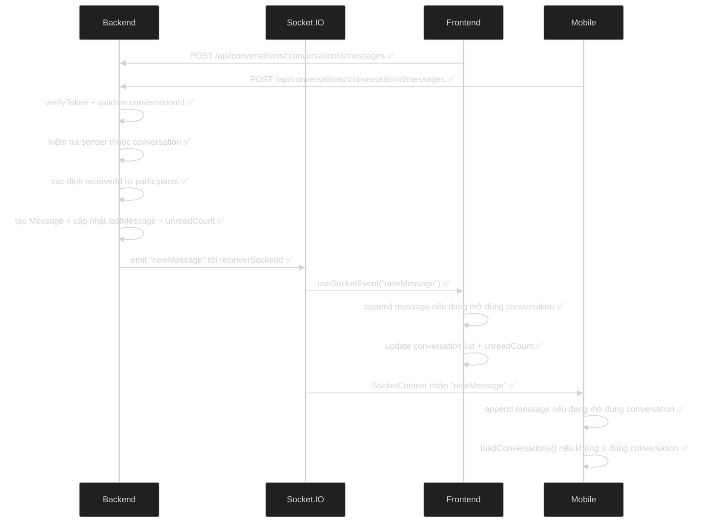
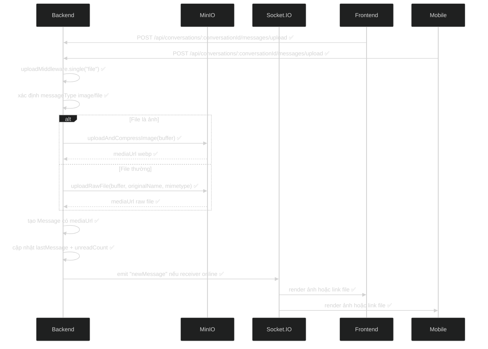
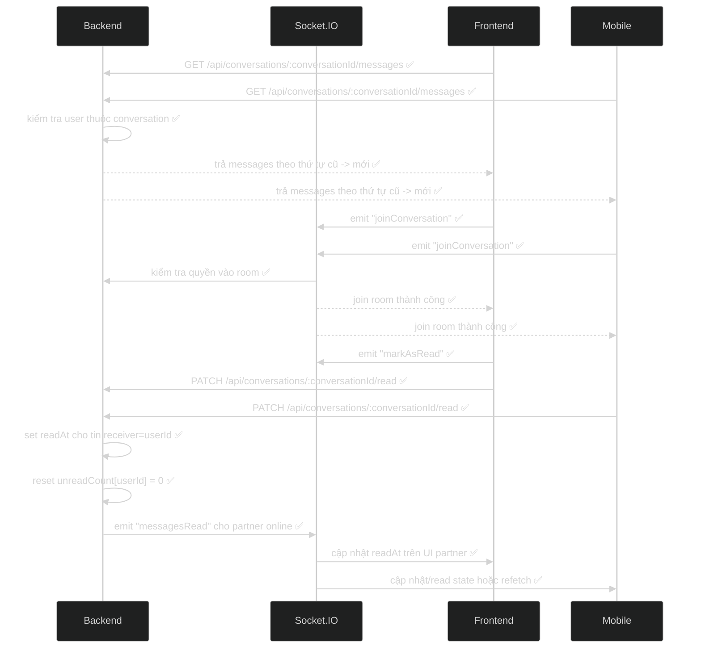
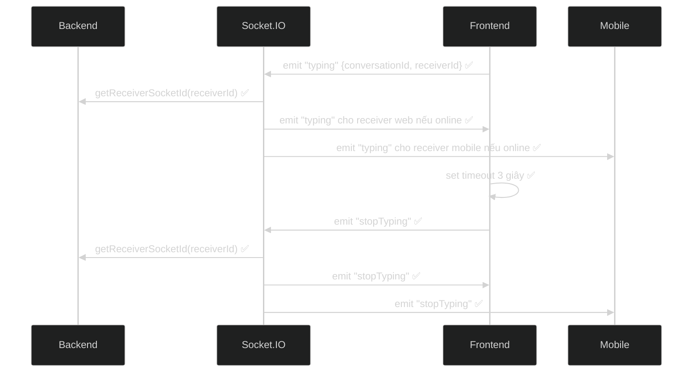
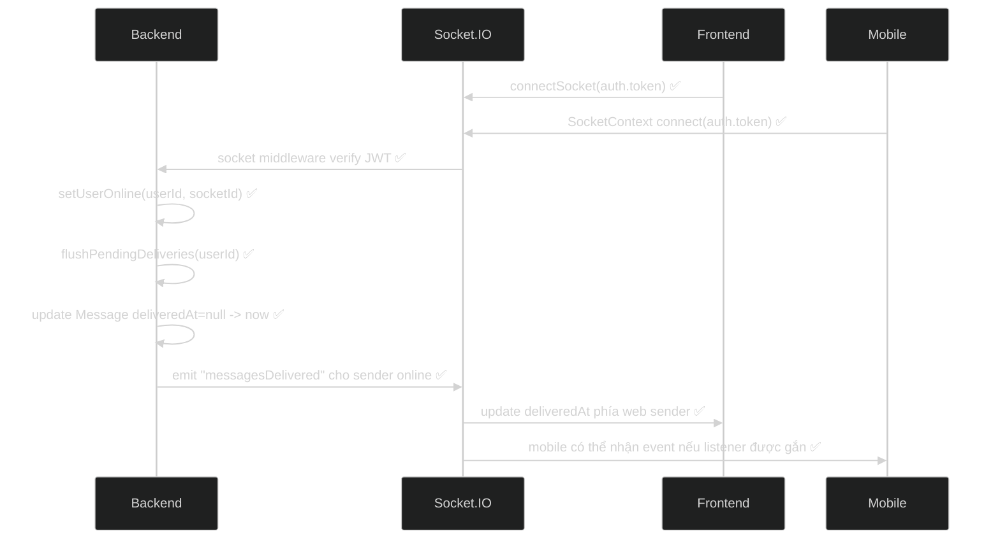
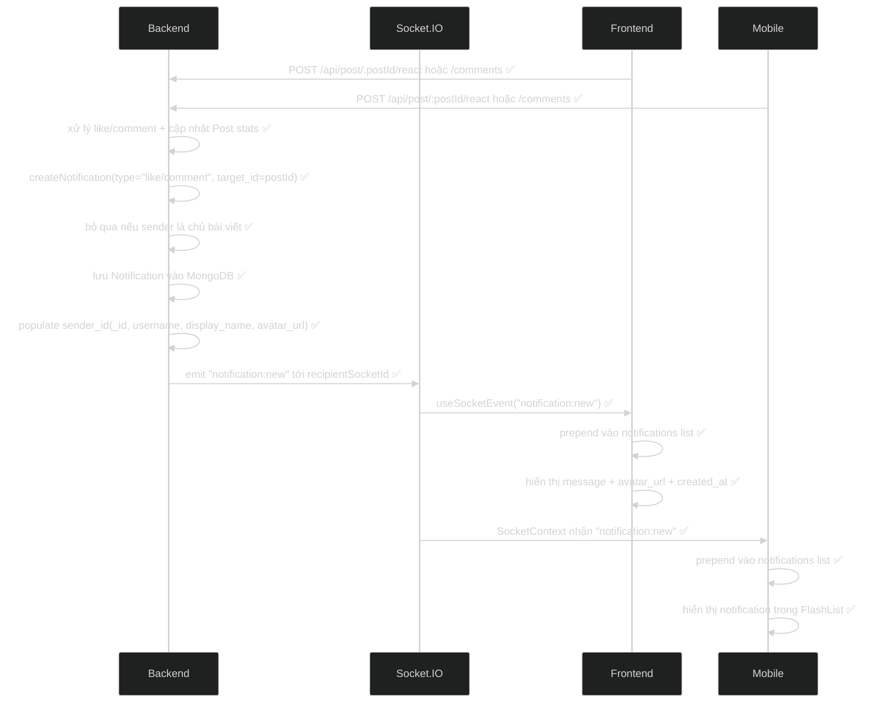
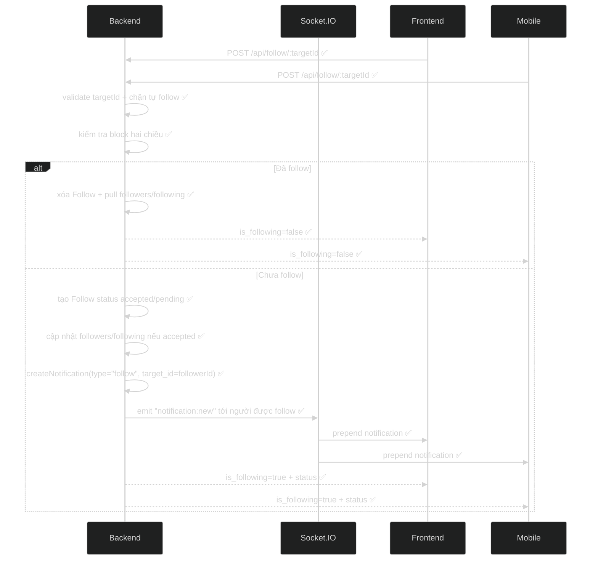
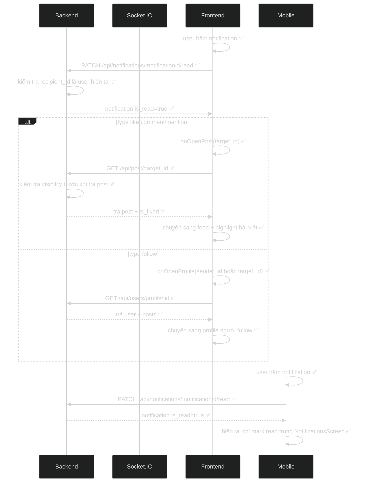
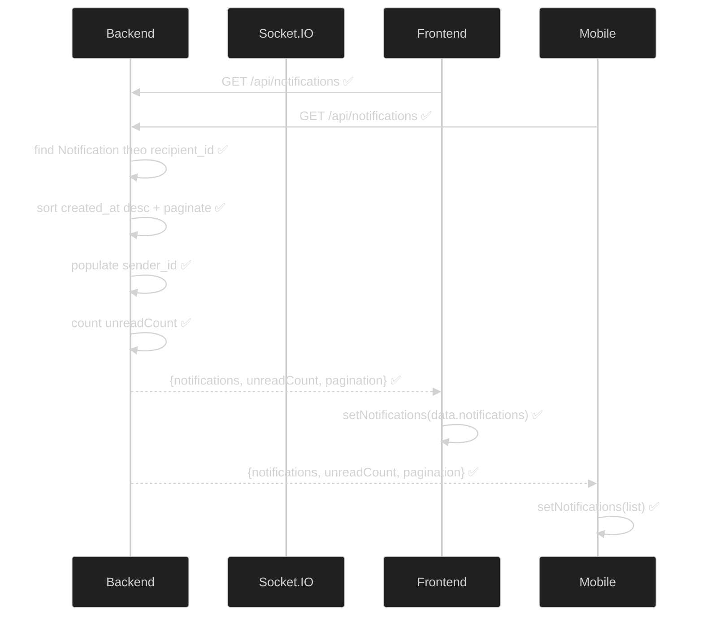

# Sequence Diagram Nhắn tin và Thông báo

Ngày lập: 27/05/2026

Tài liệu này vẽ sequence diagram theo kiểu flow kiểm tra hiện tại: các lane chính gồm `Backend`, `Socket.IO`, `Frontend`, `Mobile`, có đánh dấu trạng thái bằng `✅`.

## 1. Kiểm tra nhắn tin realtime qua Socket.IO

Flow hiện tại:

Ghi chú:

- Web append tin nhắn realtime qua `useSocketEvent("newMessage")`.
- Mobile nhận qua `SocketContext`, đồng thời vẫn có polling fallback 3 giây khi đang mở hội thoại.
- Backend chỉ emit realtime nếu receiver đang online và có `receiverSocketId`.

## 2. Kiểm tra gửi ảnh/file trong tin nhắn

Flow hiện tại:

Ghi chú:

- Backend dùng cùng controller `sendMessage()` cho text và upload.
- Ảnh được nén WebP trước khi lưu MinIO.
- File thường/video được upload raw.

## 3. Kiểm tra mở hội thoại và đánh dấu đã đọc

Flow hiện tại:

Ghi chú:

- Web hiện gọi cả socket `markAsRead` và REST `PATCH /read`.
- Mobile gọi REST `PATCH /read`.
- Các thao tác này idempotent, chạy lại không làm sai dữ liệu.

## 4. Kiểm tra typing indicator

Flow hiện tại:

Ghi chú:

- Web đã có `sendTyping()` trong `useMessages()`.
- Backend đã có handler `typing` và `stopTyping`.
- Mobile hiện tập trung vào nhận/gửi message; typing indicator chưa đầy đủ như web.

## 5. Kiểm tra delivered khi user online lại

Flow hiện tại:

Ghi chú:

- Backend đã có `flushPendingDeliveries()`.
- Web hook đã listen `messagesDelivered`.
- Mobile hiện chưa thể hiện rõ listener riêng cho `messagesDelivered` trong màn Messages.

## 6. Kiểm tra thông báo đẩy Like/Comment qua Socket.IO

Flow hiện tại:

Ghi chú:

- `like` và `comment` dùng `target_id = postId`.
- Frontend web có thể bấm thông báo để mở bài viết theo `target_id`.
- Mobile hiện mới mark read khi bấm notification, chưa thấy điều hướng mở bài viết trong màn notification hiện tại.

## 7. Kiểm tra thông báo đẩy Follow qua Socket.IO

Flow hiện tại:

Ghi chú:

- `follow` dùng `target_id = followerId`.
- Web ưu tiên mở profile theo `sender_id`, fallback `target_id`.

## 8. Kiểm tra mở thông báo để điều hướng

Flow hiện tại:

Ghi chú:

- Web đã có luồng điều hướng hoàn chỉnh.
- Mobile hiện chưa có logic điều hướng theo `target_id`/`sender_id` trong `NotificationsScreen`.

## 9. Kiểm tra tải danh sách thông báo

Flow hiện tại:

## 10. Tổng hợp trạng thái hiện tại

| Luồng | Backend | Frontend Web | Mobile |
| --- | --- | --- | --- |
| Gửi text message | ✅ | ✅ | ✅ |
| Gửi ảnh/file message | ✅ | ✅ | ✅ |
| Nhận `newMessage` realtime | ✅ | ✅ | ✅ |
| Polling fallback message | Không cần | Không dùng | ✅ |
| Join/leave conversation room | ✅ | ✅ | ✅ |
| Mark read message | ✅ | ✅ | ✅ |
| Typing indicator | ✅ | ✅ | Chưa đầy đủ |
| Delivered receipt | ✅ | ✅ | Chưa đầy đủ |
| Tạo notification like/comment/follow | ✅ | ✅ | ✅ |
| Nhận `notification:new` realtime | ✅ | ✅ | ✅ |
| Mark notification read | ✅ | ✅ | ✅ |
| Click notification mở bài/profile | ✅ | ✅ | Chưa đầy đủ |

## 11. Event Socket.IO đang dùng

| Event | Hướng | Web | Mobile | Ghi chú |
| --- | --- | --- | --- | --- |
| `newMessage` | Backend -> Client | ✅ | ✅ | Đẩy tin nhắn mới |
| `typing` | Client -> Backend -> Client | ✅ | Chưa đầy đủ | Web đang dùng rõ |
| `stopTyping` | Client -> Backend -> Client | ✅ | Chưa đầy đủ | Web timeout 3 giây |
| `joinConversation` | Client -> Backend | ✅ | ✅ | Join room khi mở chat |
| `leaveConversation` | Client -> Backend | ✅ | ✅ | Leave room khi đổi chat |
| `markAsRead` | Client -> Backend -> Partner | ✅ | Chưa đầy đủ | Mobile dùng REST là chính |
| `messagesRead` | Backend -> Partner | ✅ | Chưa đầy đủ | Web listen trong hook |
| `messagesDelivered` | Backend -> Sender | ✅ | Chưa đầy đủ | Backend đã emit khi receiver online lại |
| `messageDeleted` | Backend -> Partner | Có backend emit | Chưa rõ UI | Dùng khi xóa tin |
| `notification:new` | Backend -> Recipient | ✅ | ✅ | Đẩy thông báo realtime |
| `notification:read` | Client -> Backend | Backend có handler | Backend có handler | Web/mobile hiện dùng REST là chính |
| `notification:readAll` | Client -> Backend | Backend có handler | Backend có handler | Web/mobile hiện dùng REST là chính |

## 12. API REST chính

| Chức năng | Endpoint | Trạng thái |
| --- | --- | --- |
| Danh sách hội thoại | `GET /api/conversations` | ✅ |
| Tạo/mở hội thoại | `POST /api/conversations/:receiverId` | ✅ |
| Lấy tin nhắn | `GET /api/conversations/:conversationId/messages` | ✅ |
| Gửi text | `POST /api/conversations/:conversationId/messages` | ✅ |
| Gửi file/ảnh | `POST /api/conversations/:conversationId/messages/upload` | ✅ |
| Đánh dấu hội thoại đã đọc | `PATCH /api/conversations/:conversationId/read` | ✅ |
| Danh sách thông báo | `GET /api/notifications` | ✅ |
| Đánh dấu một thông báo đã đọc | `PATCH /api/notifications/:notificationId/read` | ✅ |
| Đánh dấu tất cả thông báo đã đọc | `PATCH /api/notifications/read-all` | ✅ |
| Mở bài từ thông báo | `GET /api/post/:postId` | ✅ |
| Mở profile từ thông báo follow | `GET /api/users/profile/:id` | ✅ |
